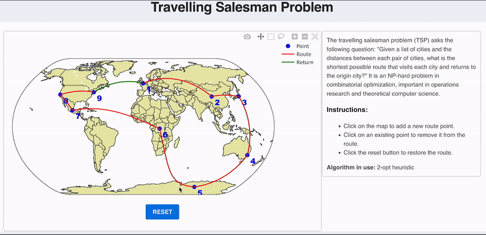

## Travelling salesman demo

Visualize the travelling salesman problem with a map in which you can add and remove stops with a click. 

The optimization problem is solved with JuMP for up to 9 stops, and the heuristic two-opt algorithm afterwards. The plot is implemented with PlotlyJS.



## Installation

Clone the repository and install the dependencies:

First `cd` into the project directory then run:

```bash
$> julia --project -e 'using Pkg; Pkg.instantiate()'
```

Then run the app

```bash
$> julia --project
```

```julia
julia> using GenieFramework
julia> Genie.loadapp() # load app
julia> up() # start server
```

## Usage

Open your browser and navigate to `http://localhost:8000/`


